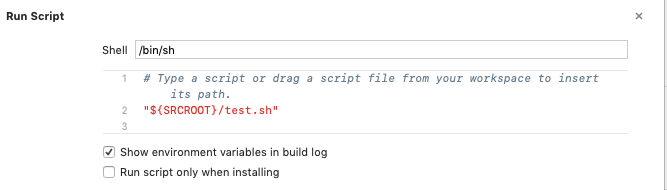

# j2objc

[学习链接](https://www.jianshu.com/p/2cbe6c2806a4)

[下载 j2objc](https://github.com/google/j2objc/releases)

## xcode 工程 mrc 配置文件

* 点击Build Rules菜单项，然后点击"+"增加一个编译规则，Process选项选择Java source files，Using选项选择默认的Custom script。

if [ ! -f "${J2OBJC_HOME}/j2objc" ]; then echo "J2OBJC_HOME is not correctly defined, currently set to '${J2OBJC_HOME}'"; exit 1; fi;
"${J2OBJC_HOME}/j2objc" -d ${DERIVED_FILES_DIR} -sourcepath "$source-root" --no-package-directories -g ${INPUT_FILE_PATH};

## xcode 工程 arc 配置文件

f [ ! -f "${J2OBJC_HOME}/j2objc" ]; then echo "J2OBJC_HOME is not correctly defined, currently set to '${J2OBJC_HOME}'"; exit 1; fi;
"${J2OBJC_HOME}/j2objc" -d ${DERIVED_FILES_DIR} -sourcepath "${PROJECT_DIR}/AirportBase/JavaSource" --no-package-directories -use-arc --prefix com.example.mango.*=MM -g ${INPUT_FILE_PATH};

## 在下边的Output Files面板中，点击 + 按钮

添加{DERIVED_FILES_DIR}/{INPUT_FILE_BASE}.h，再点击 + 按钮，添加{DERIVED_FILES_DIR}/{INPUT_FILE_BASE}.m

### 配置说明

J2OBJC_HOME：官方的下载 j2objc 的路径
DERIVED_FILES_DIR：导出路径
${PROJECT_DIR}/AirportBase/JavaSource：需要翻译的 java 工程目录
${INPUT_FILE_PATH}：导出类命

### build Setting

为Framework Search Paths 添加 ${J2OBJC_HOME}/frameworks
为Library Search Paths 添加 ${J2OBJC_HOME}/lib
为User Header Search Paths 添加 ${J2OBJC_HOME}/include

在build settings的Other Linker Flags 中添加一个值-ljre_emul
在build settings的Other Linker Flags 中添加一个链接库选项-liconv

### 说明-

* J2OBJC_HOME：官方的下载 j2objc 的路径

### 特殊说明

1. 使用本 demo 需要 注意 J2OBJC_HOME 的路径问题，并修改所有的 J2OBJC_HOME 为 你自己工程中的 相应路径即可
2.尝试成功

## 理解 build phases 和 build rule

### 理解来源

[友情链接](https://www.cocoanetics.com/2012/02/xcode-build-rules/)

### build phases

 build phases 中，可以添加编译所需要的脚本。
 可以直接引用脚本，也可以直接 写入脚本语言

### build rule

 1. 给 xcode 某些文件添加（.java/.css 等），custom compile
 2. 每个脚本对应每一个文件进行 custom compile

### example

 1. https://github.com/sharephoenix/javascriptWeexVue.git
 中的 OCWeexNative 工程 v1.0.1component 分支
 2. 有 xxd 将 .css 编译成 .c 文件

## 运行脚本

* j2objc.sh - 为脱离工程，将 java 编译成 OC 的脚本
* 其他脚本均为探索中的脚本，等待整理学习
